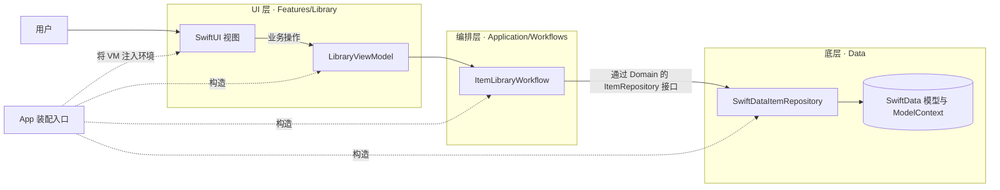
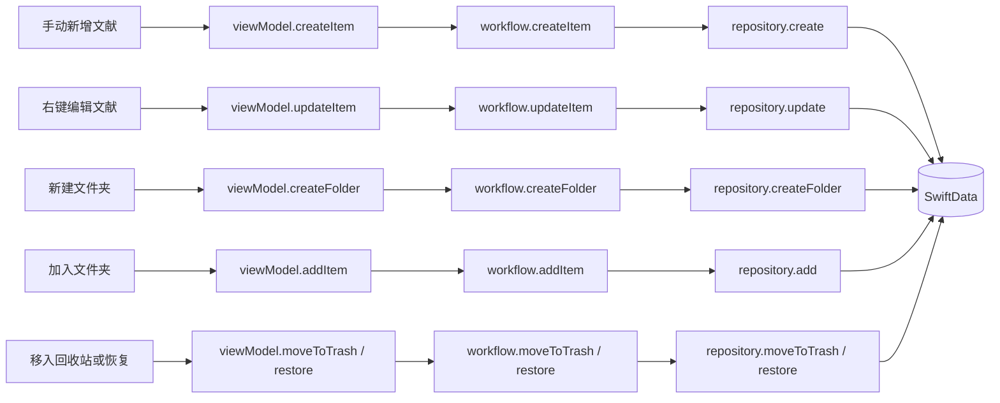
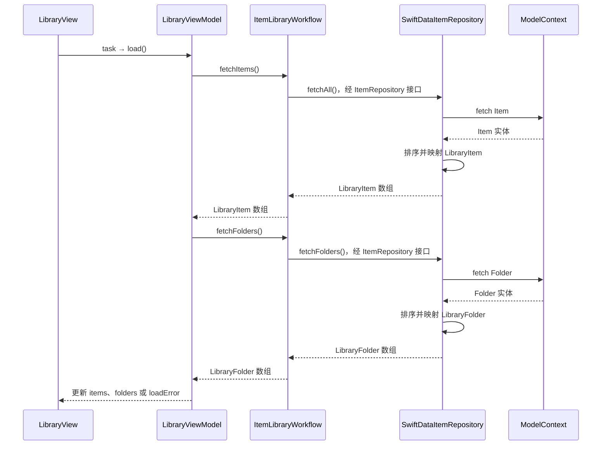
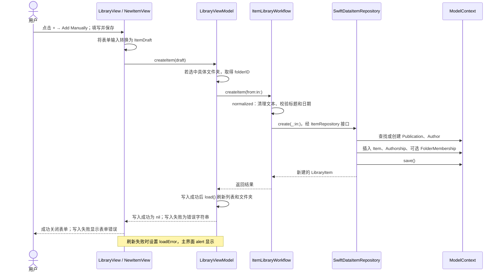
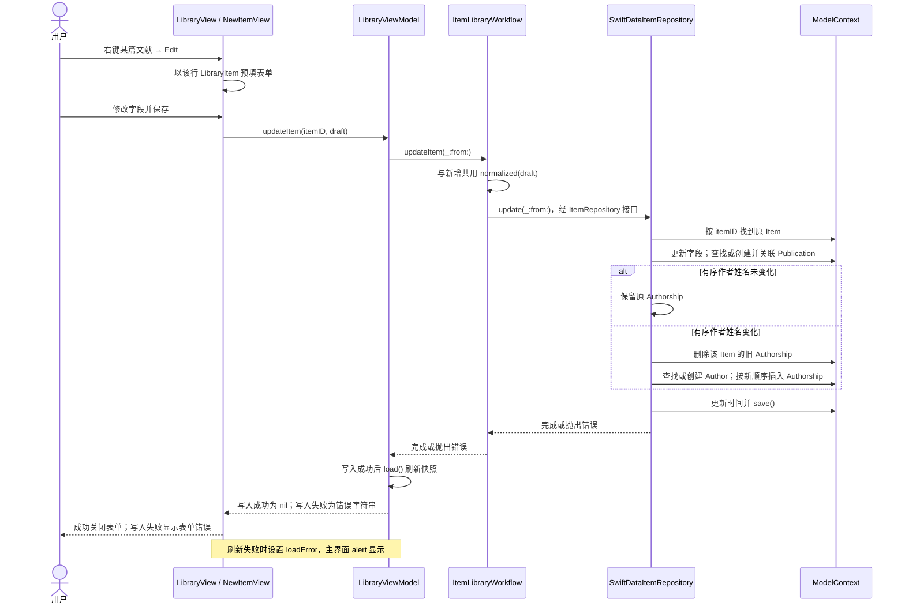

# Refolio 架构

本文说明 Refolio 的产品边界、当前代码结构、三层职责、数据关系、实际调用链及后续扩展位置。所有“已实现”的描述均以当前源码为准；标为“计划”的部分尚无可用功能或实现文件。

## 一、整体设计

Refolio 是原生 macOS 文献管理应用，目标是在文献资料管理的基础上加入 PDF 阅读。当前已经实现本地文献、文件夹和回收站的基础操作；PDF 导入与阅读、阅读位置、笔记以及 DOI 在线获取仍是计划。

项目目前只有一个 Xcode App target。代码在 UI 侧按功能组织，在其余部分按职责组织。需要新的真实功能时再增加文件或目录，不预建空模块。



这里的“三层”是 **UI、编排、底层实现**。`Domain` 承载跨层约定，不要求每个动作都多造一层对象。网络客户端与文件存储如果将来加入，也属于底层能力，由编排层协调。

### 功能现状

| 功能 | 状态 |
| :-- | :-- |
| 浏览文献、按文件夹筛选、搜索、查看元数据 | 已实现 |
| 手动新增、右键编辑文献 | 已实现 |
| 新增文件夹、将文献加入文件夹 | 已实现 |
| 移入回收站、恢复文献 | 已实现；属于软删除 |
| 手动填写 DOI 字符串 | 已实现；没有 DOI 在线查询 |
| 附件的 SwiftData 模型 | 已定义；没有导入或展示附件的流程 |
| PDF 阅读、阅读位置和笔记 | 计划，未实现 |
| 删除或重命名文件夹、永久删除文献 | 未实现 |

## 二、目录及职责

以下是当前存在的源码目录与主要文件；资源文件从略，不把规划中的目录写成现状。

```text
Refolio/
├── App/
│   └── RefolioApp.swift
├── Features/Library/
│   ├── UI/
│   │   ├── LibraryView.swift
│   │   ├── NewItemView.swift
│   │   ├── NewFolderView.swift
│   │   └── ItemDetailView.swift
│   └── State/
│       └── LibraryViewModel.swift
├── Application/Workflows/
│   └── ItemLibraryWorkflow.swift
├── Domain/
│   ├── Models/ItemDraft.swift
│   └── Repositories/ItemRepository.swift
├── Data/
│   ├── Persistence/
│   │   ├── DebugSampleData.swift
│   │   └── Models/
│   │       ├── Item.swift
│   │       ├── Publication.swift
│   │       ├── Author.swift
│   │       ├── Authorship.swift
│   │       ├── Folder.swift
│   │       ├── FolderMembership.swift
│   │       └── Attachment.swift
│   └── Repositories/
│       └── SwiftDataItemRepository.swift
└── Resources/Assets.xcassets/
```

| 位置 | 拥有什么 | 不拥有什么 |
| --- | --- | --- |
| `App` | 容器创建、具体实现装配、依赖注入 | 文献业务规则、UI 操作步骤 |
| `Features/Library/UI` | 展示、交互、表单和弹窗；把用户动作交给视图模型 | `ModelContext`、SQL/SwiftData 查询、文件复制、HTTP 请求 |
| `Features/Library/State` | 供视图使用的快照、搜索与导航状态、一个动作对应的入口 | SwiftData 模型关系及文件系统细节 |
| `Application/Workflows` | 输入规范化、业务校验、多个底层能力之间的步骤 | SwiftData 实体和视图组件 |
| `Domain` | 工作流输入/输出类型、底层接口 | 实际数据库或网络实现 |
| `Data` | 模型、持久化查询、实体关系、保存 | 窗口、弹窗或工具栏状态 |

依赖从 UI 指向编排层，编排层只依赖 `Domain` 的 `ItemRepository`。`Data` 实现该接口，`App` 将具体实现提供给工作流。视图不创建仓储；仓储不引用 SwiftUI。

视图模型属于 UI 边界。它汇集界面状态、转发用户动作，并在成功写入后重新载入快照。它不是第二个数据库层。当前编排层有些方法很短，是因为它们现在只需校验后执行一次完整的仓储操作；不为增加“编排感”而把一次数据库写入拆成多个对外调用。

### 新代码放在哪里

- 新表单、菜单、阅读界面：先放在对应功能的 `Features` 目录。
- 用户动作涉及校验、网络与数据库、或文件与数据库的先后顺序：在 `Application/Workflows` 给出一个明确的动作入口。
- SwiftData 查询、实体关联、同一次保存：放在 `Data`。这些步骤可以在仓储内复用私有方法。
- DOI 请求与解析、PDF 文件复制和安全作用域访问：实现时放入各自底层目录，由 App 装配给工作流；当前没有这些目录或客户端。
- 协议只用于真实跨层能力边界；不为每个私有函数单独创建协议。

## 三、启动、装配和线程

`RefolioApp.init()` 创建 `ModelContainer`，注册七种 SwiftData 模型：`Item`、`Publication`、`Author`、`Authorship`、`Attachment`、`Folder`、`FolderMembership`。随后用 `container.mainContext` 创建 `SwiftDataItemRepository`，再创建 `ItemLibraryWorkflow` 和 `LibraryViewModel`。`WindowGroup` 呈现 `LibraryView`，通过环境注入视图模型并挂载同一个模型容器。

Debug 构建调用 `DebugSampleData.seedIfNeeded`：仅当 `Item` 表为空时插入三篇示例文献和一个示例文件夹，前两篇属于该文件夹。已有文献时不会再次播种。当前容器或示例数据初始化失败会 `fatalError`。

`LibraryViewModel`、`ItemLibraryWorkflow` 和 `SwiftDataItemRepository` 当前都标为 `@MainActor`；仓储使用主 `ModelContext`，方法为同步 `throws`。这是现状描述。未来 PDF 读取、文件处理和网络请求需要明确异步边界，不能把耗时工作直接塞进同步 UI 路径。

## 四、数据模型

### 核心实体及关系

| 实体 | 含义 | 当前关键字段与关系 |
| --- | --- | --- |
| `Item` | 一篇文献的主记录 | UUID、标题、摘要、DOI、发表日期、卷期页、URL、创建/修改时间、`isTrashed`；关联期刊、作者关系、文件夹关系、附件 |
| `Publication` | 发表载体 | 名称、`literatureType`，另有缩写、出版者、ISSN、ISBN 和 URL 字段；可被多篇文献引用 |
| `Author` | 可复用的作者实体 | 姓名组成或字面姓名、ORCID；`displayName` 用于显示和当前匹配 |
| `Authorship` | 文献与作者的关联记录 | `item`、`author`、作者顺序 `position`、可选 `role` |
| `Folder` | 集合式文件夹 | UUID、名称、创建时间及成员关系 |
| `FolderMembership` | 文献与文件夹的关联记录 | `item`、`folder`、加入时间 |
| `Attachment` | 属于文献的文件记录 | 文件名、类型、大小、导入时间、受管理相对路径或安全作用域书签、`item` |

```text
Publication 1 ── 0..n Item
                      │
                      ├── 0..n Authorship n..1 ── Author
                      ├── 0..n FolderMembership n..1 ── Folder
                      └── 0..n Attachment
```

一篇 `Item` 无需 PDF 也能存在，并可拥有多个 `Attachment`。`Item` 不重复保存文献类型，而是通过 `Publication.literatureType` 获得。作者是多对多关系，顺序存在关联记录中；文件夹也是多对多集合，一篇文献进入多个文件夹不会复制主记录。

模型定义的删除规则是：删除 `Item` 时级联删除它的 `Authorship`、`FolderMembership` 和 `Attachment` **记录**；删除 `Folder` 时级联删除成员关联；删除 `Author` 时级联删除作者关联；删除 `Publication` 时对 `Item` 的引用采用 nullify。这些规则不代表当前 UI 已提供永久删除操作，更不代表已经实现附件实体删除时的磁盘文件清理。

回收站目前只修改 `Item.isTrashed`。文献主记录与它的关联仍在数据库内；恢复操作把布尔值改回 `false`。当前没有彻底删除文献的仓储方法或 UI 入口。

### 跨层数据类型

`ItemDraft` 是新增和编辑的输入：包含可编辑的文献元数据与有序作者姓名，不包含 SwiftData 对象。`LibraryItem` 是给 UI 使用的只读文献快照，包含展示字段、作者姓名、文件夹 ID 和回收站状态；当前不含附件或阅读状态。`LibraryFolder` 包含 ID、名称和文献计数。`FolderSelection` 表示全部文献、未归档、回收站或指定文件夹。

UI 不直接持有可变 `Item`。编辑时用 `LibraryItem` 预填表单，再以其 UUID 调用更新入口；仓储按 UUID 找到持久化的 `Item`。

### 当前匹配与更新语义

- 创建文献时，仓储按作者展示名匹配已有 `Author`，比较忽略大小写和变音符号；找不到就新建使用 `literalName` 的作者。输入顺序写入 `Authorship.position`。
- `Publication` 根据名称（比较忽略大小写和变音符号）以及精确的 `literatureType` 复用或创建；没有发表载体名称时，文献的关联为 `nil`。
- 编辑文献时，仓储修改文献的标量字段及 `publication` 引用。有序作者姓名未变时保留原 `Authorship`；变化时只重建这篇文献的 `Authorship`，不删除共享的 `Author`。文献 ID、创建时间、回收站状态、附件和文件夹关系不变。
- `Authorship.role` 是当前未使用的可选字段；现有创建和编辑表单不输入它，新增关联时它为 `nil`。
- 同名文件夹在仓储中被复用，名称比较忽略大小写和变音符号。同一文献重复加入同一文件夹时，仓储不插入第二条关联。

当前没有 DOI 唯一约束或文献去重工作流。按姓名复用作者是现有规则，不能据此认定同名作者必然是同一人。

## 五、界面结构与状态

`LibraryView` 使用两列 `NavigationSplitView`：左侧是 Library/文件夹导航，主内容是文献列表；文献资料通过附着在列表上的原生 `inspector` 呈现。详情目前只读。左侧工具栏有新增文件夹；主内容工具栏有 `+` 菜单，其“Add Manually”打开手动新增表单，另有原生搜索项。DOI 菜单项还没有实现。

UI 宽度常量集中在 `LibraryView.swift` 顶部：侧栏最小 180、最大 340；inspector 最小 180、理想 260、最大 300。窗口最小尺寸为 900 × 600。它们属于 UI 布局，不进入工作流或仓储。

| 状态 | 所有者 | 意义 |
| --- | --- | --- |
| `items`、`folders` | `LibraryViewModel` | 最近一次载入的文献和文件夹快照 |
| `searchText`、`selectedFolder` | `LibraryViewModel` | 当前搜索词和导航范围 |
| `loadError` | `LibraryViewModel` | 读取失败信息 |
| `selectedItemID` | `LibraryView` | 列表选中项与详情显示依据 |
| `editingItem` | `LibraryView` | 正在编辑的文献快照 |
| `showingNewItem`、`showingNewFolder` | `LibraryView` | 表单呈现状态 |
| `isInspectorPresented` | `LibraryView` | 详情栏呈现状态，初始为 `true` |
| `actionError` | `LibraryView` | 列表右键操作错误 |
| 输入字段和 `errorMessage` | 两个表单视图 | 尚未提交的输入及表单内错误 |

`LibraryViewModel.filteredItems` 先按 `FolderSelection` 筛选：全部文献和普通文件夹排除回收站记录；未归档要求无文件夹关系；回收站只取被标记的记录。随后在已加载的数组中，用去首尾空白的搜索词匹配标题、DOI、发表载体名称和作者姓名。当前搜索不是数据库全文检索，也不匹配摘要或 URL。

详情按 `selectedItemID` 在**当前筛选结果**里查文献；筛选后不可见则显示占位内容。`ItemDetailView` 当前展示标题、作者、发表载体、类型、日期、DOI、页码、摘要及 URL 链接。`Item` 虽存有卷和期，当前详情视图尚未展示它们。

## 六、实际操作链路

下图先汇总**现有持久化动作**的入口；后面的顺序图展示每一步由哪一层执行。搜索、切换文件夹和选择文献属于界面状态更新，不经过写入工作流。



### 载入与刷新



新增、编辑、加入文件夹、移入回收站及恢复成功后，视图模型重新执行 `load()`。仓储返回值是 UI 快照；搜索和导航筛选再由视图模型计算。

### 手动新增文献



当前选中具体文件夹时，视图模型把该文件夹 ID 作为新文献的初始归属；在其他导航项新增时传 `nil`。表单先把年月日文本解析成可选整数；工作流再做数值范围与真实日期校验。

### 编辑文献



右键使用被点击行的 ID，与此前选中的详情项无关。UI 对保存只调用一个视图模型方法；编排层对更新只调用一个仓储方法。作者、发表载体关系的查找和持久化在仓储方法内部完成，使同一数据库操作不被拆散到视图。

### 文件夹与回收站

| 用户动作 | 调用方向 | 持久化结果 |
| --- | --- | --- |
| 新增文件夹 | 表单 → `viewModel.createFolder` → workflow → repository | 复用同名文件夹或插入 `Folder`；视图模型选中它 |
| 加入文件夹 | 行菜单 → `viewModel.addItem` → workflow → repository | 插入不存在的 `FolderMembership` |
| 移入回收站 | 行菜单 → `viewModel.moveToTrash` → workflow → repository | `isTrashed = true`，更新时间 |
| 恢复文献 | 回收站行菜单 → `viewModel.restore` → workflow → repository | `isTrashed = false`，更新时间 |

当前没有“移出文件夹”、删除或重命名文件夹、永久删除文献的操作入口。

### 错误传递

工作流和仓储用 `throws` 向上传递错误。视图模型把写入错误转换为 `String?`：表单把错误显示在表单内部，成功时关闭；列表右键操作把错误放入 `LibraryView.actionError`，通过 alert 展示。载入错误保存在 `LibraryViewModel.loadError`，也通过同一个 alert 展示。标题/日期/文件夹名称错误由工作流生成；年月日输入不是整数时由表单先提示。

## 七、计划功能的架构位置

本节描述将来的责任划分，不代表这些接口和目录现在已经存在。

### PDF 附件导入

最小流程是选择现有文献和 PDF → 导入文件 → 建立 `Attachment` 记录及所属 `Item` 关系 → 在详情中显示并能打开。UI 负责选文件及传目标文献 ID，调用一个“添加附件”工作流；工作流决定文件和数据库操作的先后顺序以及失败收尾；底层文件存储负责复制文件或管理访问授权，底层仓储负责附件关系与保存。两处资源必须有清楚的失败处理，不能留下指向不存在文件的附件记录。

`Attachment` 已有 `managedRelativePath` 和 `securityScopedBookmark` 字段，但目前没有文件存储实现、附件仓储接口、文件导入 UI 或附件展示字段。正式实现时先确定文件所有权，再补真实需要的类型和方法。PDF 文件是文献的附件，不替代 `Item`。

### PDF 阅读、阅读位置和笔记

附件能够稳定打开后再接入阅读器。阅读位置与具体文献、具体附件相关；页级笔记至少需要关联附件和页码。当前没有阅读器、阅读位置和笔记模型。阅读器的呈现方式应在实现时确定；现有 180–300 宽的 inspector 仅承担资料详情。

### DOI 在线获取

当前 DOI 文本框仅保存手动输入。未来通过 DOI 新增时，UI 应调用一个工作流；工作流协调 DOI 网络客户端、资料映射、用户确认和持久化。HTTP 请求与响应解析归底层集成，SwiftData 仓储不发网络请求。当前没有 DOI 客户端、DOI 菜单项或自动查重规则。

## 八、扩展时保持的边界

1. 先定义用户动作的输入、结果和失败，再给 UI 一个明确的调用入口。UI 不串联数据库、网络与文件操作。
2. 编排层负责业务规则和跨底层能力的顺序；SwiftData 查询、关联与一次完整保存由底层负责。可复用的数据库小步骤优先放在仓储内部。
3. 更新文献时区分主记录、作者、发表载体、文件夹和附件的身份，只改变该动作涉及的关系。
4. 文件与数据库共同参与的动作要在工作流中明确失败边界；只有数据库参与的动作保持单一仓储写入入口。
5. 新目录、协议或共享组件只在首个真实调用点出现时加入。保持一个 App target，除非独立构建或复用确有价值。
6. 文档中“已实现”以当前代码和实际行为为准。构建成功不等于数据库关系、文件 IO 或 UI 操作已经完成运行时验收。
