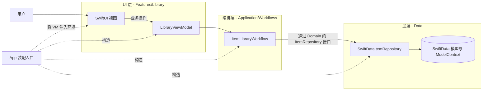
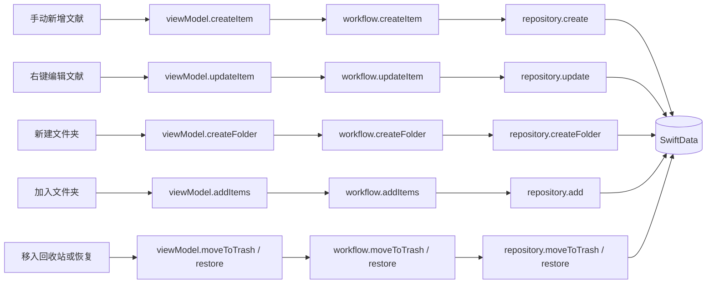
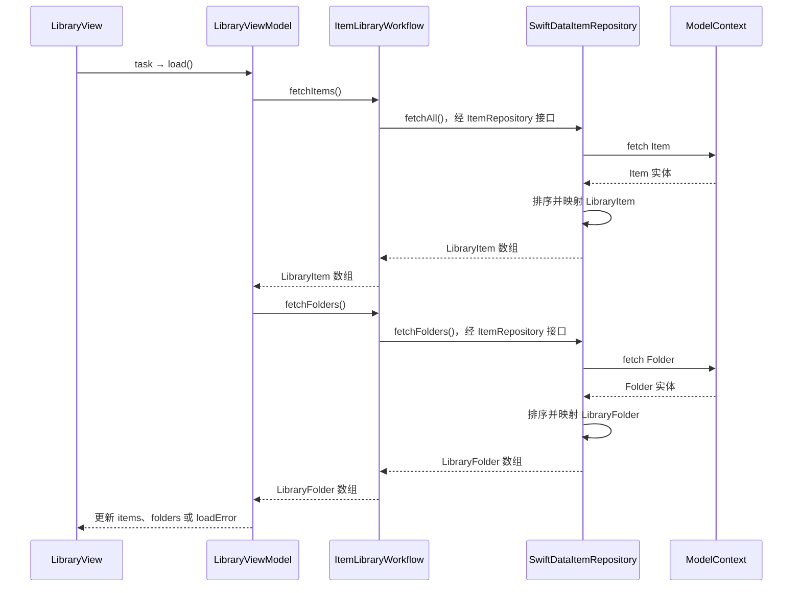
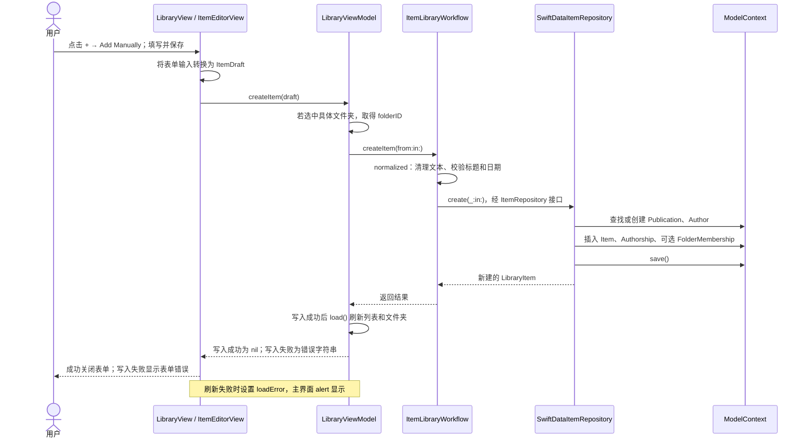
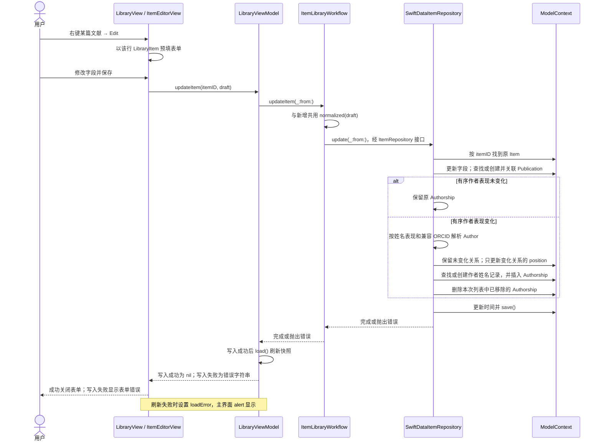
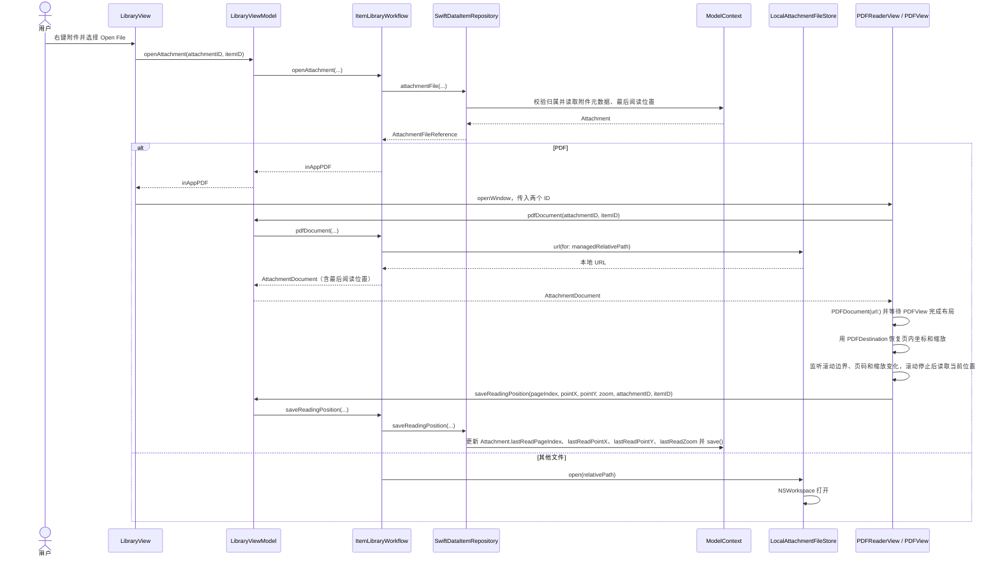
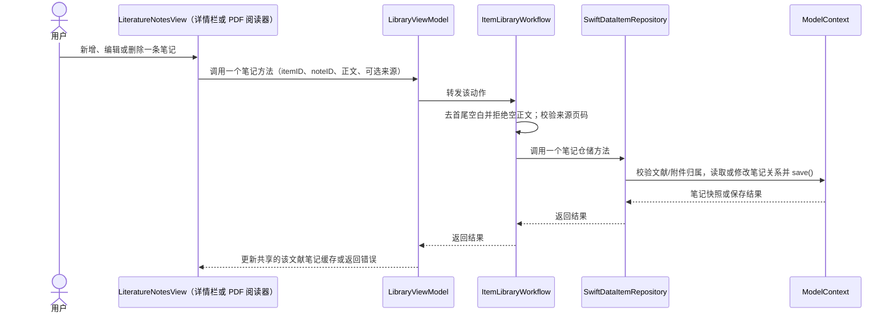

# Refolio 架构

本文说明 Refolio 的产品边界、当前代码结构、三层职责、数据关系、实际调用链及后续扩展位置。所有“已实现”的描述均以当前源码为准；标为“计划”的部分尚无可用功能或实现文件。

## 一、整体设计

Refolio 是原生 macOS 文献管理应用。当前已实现本地文献、文件夹、回收站、附件导入、PDF 应用内阅读、多文档阅读标签页、文献笔记、DOI 查询与更新、可配置翻译引擎和 PDF 标注；按附件恢复精确阅读位置已运行验收，标注、笔记和翻译仍需以真实文库继续运行验收。

项目目前只有一个 Xcode App target。代码在 UI 侧按功能组织，在其余部分按职责组织。需要新的真实功能时再增加文件或目录，不预建空模块。


```mermaid
flowchart LR
    User[用户]
    subgraph UI[UI 层 · Features/Library]
        View[SwiftUI 视图]
        VM[LibraryViewModel]
        View -->|业务操作| VM
    end
    subgraph Application[编排层 · Application/Workflows]
        WF[ItemLibraryWorkflow]
    end
    subgraph Data[底层 · Data]
        Repo[SwiftDataItemRepository]
        DB[(SwiftData 模型与 ModelContext)]
        Repo --> DB
    end
    User --> View
    VM --> WF
    WF -->|通过 Domain 的 ItemRepository 接口| Repo
    App[App 装配入口] -.构造.-> Repo
    App -.构造.-> WF
    App -.构造.-> VM
    App -.将 VM 注入环境.-> View
```

这里的“三层”是 **UI、编排、底层实现**。`Domain` 承载跨层约定，不要求每个动作都多造一层对象。网络客户端与文件存储如果将来加入，也属于底层能力，由编排层协调。

### 功能现状

| 功能 | 状态 |
| :-- | :-- |
| 浏览文献、按文件夹筛选、搜索、查看元数据 | 已实现 |
| 手动新增、右键编辑文献 | 已实现 |
| 新增文件夹、将文献加入文件夹 | 已实现 |
| 移入回收站、恢复文献 | 已实现；属于软删除 |
| 手动填写 DOI 字符串、通过 DOI 获取元数据 | 已实现；通过 Crossref 查询并进入通用文献编辑窗口 |
| 导入文献附件 | 已实现；支持各类文件，保存在应用管理的本地目录 |
| 打开附件 | 已实现；PDF 在独立窗口内用 PDFKit 打开，其他文件交给系统打开 |
| 多文档 PDF 阅读 | 已实现；阅读器维护打开文档集合，可切换和关闭标签页 |
| 按附件记住 PDF 精确阅读位置 | 已实现并运行验收 |
| 文献笔记 | 代码已接入；详情栏和 PDF 阅读器共用，待运行验收 |
| PDF 文本高亮与框选标注 | 代码已接入；高亮从划词浮窗创建，框选在 PDF 页面拖出矩形，几何和附加评论保存到 SwiftData，重新打开时由 PDFKit 叠加显示；不改写 PDF 文件，待运行验收 |
| PDF 翻译 | 已实现；通过统一的引擎协议和注册目录选择服务，支持选中文字自动翻译、缓存和高亮 |
| 删除或重命名文件夹、永久删除文献 | 未实现 |

## 二、目录及职责

以下是当前存在的源码目录与主要文件；资源文件从略，不把规划中的目录写成现状。

```text
Refolio/
├── App/
│   ├── RefolioApp.swift
│   └── MainWorkspaceView.swift
├── Features/Library/
│   ├── UI/
│   │   ├── LibraryView.swift
│   │   ├── ItemEditorView.swift
│   │   ├── DOIUpdateComparisonView.swift
│   │   ├── NewFolderView.swift
│   │   └── ItemDetailView.swift
│   └── State/
│       └── LibraryViewModel.swift
├── Features/Reader/
│   ├── State/
│   │   └── TranslationViewModel.swift
│   └── UI/
│       ├── PDFReaderView.swift
│       ├── SafariCapsuleTabBar.swift
│       └── TranslationView.swift
├── Features/Notes/UI/
│   └── LiteratureNotesView.swift
├── Application/
│   ├── Workflows/
│   │   └── ItemLibraryWorkflow.swift
│   └── Operations/
│       ├── ItemCreateOperation.swift
│       ├── AttachImportOperation.swift
│       ├── DOILookupOperation.swift
│       ├── DOIUpdateOperation.swift
│       └── ItemDraftSupport.swift
├── Domain/
│   ├── Models/
│   │   ├── ItemDraft.swift
│   │   ├── LiteratureNote.swift
│   │   ├── TextHighlight.swift
│   │   ├── DOIUpdate.swift
│   │   └── DOIString.swift
│   └── Repositories/ItemRepository.swift
├── Data/
│   ├── FileStorage/
│   │   └── LocalAttachmentFileStore.swift
│   ├── Persistence/
│   │   ├── DebugSampleData.swift
│   │   └── Models/
│   │       ├── Item.swift
│   │       ├── Publication.swift
│   │       ├── Author.swift
│   │       ├── Authorship.swift
│   │       ├── Folder.swift
│   │       ├── FolderMembership.swift
│   │       ├── Attachment.swift
│   │       ├── LiteratureNoteRecord.swift
│   │       ├── TextHighlightRecord.swift
│   │       ├── RectangleMarkRecord.swift
│   │       └── AnnotationCommentRecord.swift
│   └── Repositories/
│       └── SwiftDataItemRepository.swift
└── Resources/Assets.xcassets/
```

| 位置 | 拥有什么 | 不拥有什么 |
| --- | --- | --- |
| `App` | 容器创建、具体实现装配、依赖注入 | 文献业务规则、UI 操作步骤 |
| `Features/Library/UI` | 展示、交互、表单和弹窗；把用户动作交给视图模型 | `ModelContext`、SQL/SwiftData 查询、文件复制、HTTP 请求 |
| `Features/Library/State` | 供视图使用的快照、搜索与导航状态、一个动作对应的入口 | SwiftData 模型关系及文件系统细节 |
| `Application/Workflows` | 一个用户动作的入口、步骤顺序 | SwiftData 实体和视图组件 |
| `Application/Operations` | 可复用的底层 API 组合（查重+创建、附件导入补偿） | UI 状态、网络细节 |
| `Domain` | 工作流输入/输出类型、底层接口、纯规则（如 DOI 归一化） | 实际数据库或网络实现 |
| `Data` | 模型、持久化查询、实体关系、保存 | 窗口、弹窗或工具栏状态 |

依赖从 UI 指向编排层，编排层只依赖 `Domain` 的 `ItemRepository`。`Data` 实现该接口，`App` 将具体实现提供给工作流。视图不创建仓储；仓储不引用 SwiftUI。

视图模型属于 UI 边界。它汇集界面状态并转发用户动作；成功写入后更新对应快照，笔记操作只更新该文献的笔记缓存。它不是第二个数据库层。当前编排层有些方法很短，是因为它们现在只需校验后执行一次完整的仓储操作；不为增加“编排感”而把一次数据库写入拆成多个对外调用。

### 新代码放在哪里

- 新表单、菜单、阅读界面：先放在对应功能的 `Features` 目录。
- 用户动作涉及校验、网络与数据库、或文件与数据库的先后顺序：在 `Application/Workflows` 给出一个明确的动作入口；若同一组合会被多条流程复用（如查重+入库、附件导入回退），抽到 `Application/Operations`。
- SwiftData 查询、实体关联、同一次保存：放在 `Data`。这些步骤可以在仓储内复用私有方法。
- PDF 文件复制和路径解析：由 `Data/FileStorage/LocalAttachmentFileStore` 实现；`AttachImportOperation` 协调附件记录与文件操作（失败时删除已复制文件）。DOI 请求与解析由 `Integrations/CrossrefClient` 和 `Application/Operations/DOILookupOperation` 实现。
- 协议只用于真实跨层能力边界；不为每个私有函数单独创建协议。

## 三、启动、装配和线程

`RefolioApp.init()` 创建 `ModelContainer`，注册十一种 SwiftData 模型：`Item`、`Publication`、`Author`、`Authorship`、`Attachment`、`LiteratureNoteRecord`、`TextHighlightRecord`、`RectangleMarkRecord`、`AnnotationCommentRecord`、`Folder`、`FolderMembership`。随后用 `container.mainContext` 创建 `SwiftDataItemRepository`，再创建 `ItemLibraryWorkflow`、`LocalAttachmentFileStore` 和 `LibraryViewModel`。主 `WindowGroup` 呈现 `LibraryView`；另一个数据驱动的 `WindowGroup` 呈现 PDF 阅读窗口，两者共享视图模型。

Debug 构建调用 `DebugSampleData.seedIfNeeded`：仅当 `Item` 表为空时插入三篇示例文献和一个示例文件夹，前两篇属于该文件夹。已有文献时不会再次播种。当前容器或示例数据初始化失败会 `fatalError`。

`LibraryViewModel`、`ItemLibraryWorkflow` 和 `SwiftDataItemRepository` 当前都标为 `@MainActor`；仓储使用主 `ModelContext`，方法为同步 `throws`。文件存储通过异步接口复制、删除文件并解析应用内相对路径。PDF 阅读页通过附件记录持久化；DOI 网络请求通过 Crossref 客户端完成。

## 四、数据模型

### 核心实体及关系

| 实体 | 含义 | 当前关键字段与关系 |
| --- | --- | --- |
| `Item` | 一篇文献的主记录 | UUID、标题、摘要、DOI、发表日期、卷期页、URL、创建/修改时间、`isTrashed`；关联期刊、作者关系、文件夹关系、附件和笔记 |
| `Publication` | 发表载体 | 名称、`literatureType`，另有缩写、出版者、ISSN、ISBN 和 URL 字段；可被多篇文献引用 |
| `Author` | 可复用的作者姓名记录 | `givenName`、`familyName`、`literalName` 和可选 ORCID；同一自然人的不同姓名表现可以是不同记录 |
| `Authorship` | 文献与作者的关联记录 | `item`、`author`、作者顺序 `position`、可选 `role` |
| `Folder` | 集合式文件夹 | UUID、名称、创建时间及成员关系 |
| `FolderMembership` | 文献与文件夹的关联记录 | `item`、`folder`、加入时间 |
| `Attachment` | 属于文献的文件记录 | 文件名、类型、大小、导入时间、最后阅读位置（页码、页内坐标、缩放值）、受管理相对路径或安全作用域书签、`item`；可被笔记作为来源并关联多条文本高亮 |
| `LiteratureNoteRecord` | 一条独立的文献笔记 | UUID、纯文本、创建/更新时间、`item`；可选来源附件和零基来源页码 |
| `TextHighlightRecord` | 一次 PDF 文本高亮 | UUID、选中文字、创建时间、颜色和按页保存的 PDF 页面矩形；关联一个附件 |
| `RectangleMarkRecord` | 一次 PDF 框选标注 | UUID、零基页码、页面矩形和创建时间；关联一个附件 |
| `AnnotationCommentRecord` | 标注附加的文字评论 | UUID、目标标注 UUID、正文和创建/更新时间；关联一个附件 |

```text
Publication 1 ── 0..n Item
                      │
                      ├── 0..n Authorship n..1 ── Author
                      ├── 0..n FolderMembership n..1 ── Folder
                      ├── 0..n Attachment
                      └── 0..n LiteratureNoteRecord
Attachment 0..n ── 0..1 LiteratureNoteRecord（sourceAttachment）
Attachment 1 ── 0..n TextHighlightRecord
Attachment 1 ── 0..n RectangleMarkRecord
Attachment 1 ── 0..n AnnotationCommentRecord（annotationID 指向高亮或框选标注）
```

一篇 `Item` 无需 PDF 也能存在，并可拥有多个 `Attachment`。`Item` 不重复保存文献类型，而是通过 `Publication.literatureType` 获得。作者是多对多关系，顺序存在关联记录中；文件夹也是多对多集合，一篇文献进入多个文件夹不会复制主记录。

模型定义的删除规则是：删除 `Item` 时级联删除它的 `Authorship`、`FolderMembership`、`Attachment` 和 `LiteratureNoteRecord` **记录**；删除 `Attachment` 时级联删除文本高亮、矩形框选和标注评论记录，删除作为笔记来源的附件时笔记保留且来源附件关系 nullify；删除 `Folder` 时级联删除成员关联；删除 `Author` 时级联删除作者关联；删除 `Publication` 时对 `Item` 的引用采用 nullify。这些规则不代表当前 UI 已提供永久删除操作，更不代表已经实现附件实体删除时的磁盘文件清理。

回收站目前只修改 `Item.isTrashed`。文献主记录与它的关联仍在数据库内；恢复操作把布尔值改回 `false`。当前没有彻底删除文献的仓储方法或 UI 入口。

### 跨层数据类型

`ItemDraft` 是新增和编辑的输入：包含可编辑的文献元数据与有序结构化作者记录，不包含 SwiftData 对象。`LibraryItem` 是给 UI 使用的只读文献快照，包含展示字段、结构化作者记录、文件夹 ID 和回收站状态；当前不含附件或阅读状态。`LibraryFolder` 包含 ID、名称和文献计数。`FolderSelection` 表示全部文献、未归档、回收站或指定文件夹。

`LiteratureNoteDraft` 是笔记新增输入；`LiteratureNote` 是给 UI 的笔记快照，包含文献 ID、正文、时间以及可选的来源文件名和零基页码。正文编辑只提交内容，保留已有来源关系。

UI 不直接持有可变 `Item`。编辑时用 `LibraryItem` 预填表单，再以其 UUID 调用更新入口；仓储按 UUID 找到持久化的 `Item`。

### 当前匹配与更新语义

- 创建文献时，仓储按 `givenName`、`familyName`、`literalName` 匹配已有作者姓名记录，比较时忽略大小写和变音符号但保留标点差异；ORCID 只用于兼容性保护，不作为姓名表现匹配键。姓名表现不同或 ORCID 状态冲突时新建 `Author`，输入顺序写入 `Authorship.position`。
- `Publication` 根据名称（比较忽略大小写和变音符号）以及精确的 `literatureType` 复用或创建；没有发表载体名称时，文献的关联为 `nil`。
- 编辑文献时，仓储修改文献的标量字段及 `publication` 引用。作者列表始终按合并逻辑处理：未变化的 `Authorship` 保留，新增作者只创建或复用 `Author` 并插入新关联，姓名表现变化会创建新的作者姓名记录，被移除的作者只删除该文献的关联，顺序变化只更新对应 `position`；共享的 `Author` 不删除，已有作者记录的字段不被 DOI 覆写。文献 ID、创建时间、回收站状态、附件和文件夹关系不变。
- `Authorship.role` 是当前未使用的可选字段；现有创建和编辑表单不输入它，新增关联时它为 `nil`。
- 同名文件夹在仓储中被复用，名称比较忽略大小写和变音符号。同一文献重复加入同一文件夹时，仓储不插入第二条关联。

当前创建/编辑会在 `ItemCreateOperation` 中做 DOI 归一化与未回收站查重（`ItemRepository.findNonTrashed(doi:)`），重复 DOI 拒绝写入并由 UI 警告；尚未做标题相似去重。没有 ORCID 的完全相同姓名表现可以复用作者姓名记录，但这不代表已经确认了自然人身份。

## 五、界面结构与状态

`LibraryView` 使用两列 `NavigationSplitView`：左侧是 Library/文件夹导航，主内容是文献列表；文献资料通过附着在列表上的原生 `inspector` 呈现。左侧工具栏有新增文件夹；主内容工具栏有 `+` 菜单，其“Add Manually”打开通用文献编辑表单，“Add by DOI…”先查询 DOI，再打开同一个编辑表单，另有原生搜索项。

UI 宽度常量集中在 `LibraryView.swift` 和 `PDFReaderView.swift`：文献管理器侧栏为 260/280/400，内容列最小 280、理想 360，详情栏为 200/300/600；阅读器侧栏为 260/280/400，内容列最小 280、理想 600，工具栏为 200/300/750。窗口最小尺寸为 900 × 600。它们属于 UI 布局，不进入工作流或仓储。

| 状态 | 所有者 | 意义 |
| --- | --- | --- |
| `items`、`folders` | `LibraryViewModel` | 最近一次载入的文献和文件夹快照 |
| `notesByItemID` | `LibraryViewModel` | 以文献 ID 为键的笔记快照；两个窗口共用 |
| `workspaceMode` | `LibraryViewModel` | 主工作区在文献管理器和阅读器之间的切换 |
| `openDocuments`、`activeDocumentAttachmentID` | `LibraryViewModel` | 已打开的 PDF 标签页及当前标签页 |
| `selectedItemIDs`、`focusedItemID` | `LibraryViewModel` | 文献列表的多选集合和当前焦点文献 |
| `attachmentFilter` | `LibraryViewModel` | 是否只显示有主文件或缺少主文件的文献 |
| `columnVisibility`、`splitViewState` | `LibraryView`、`PDFReaderView` | 三列布局的列可见性、工具栏折叠状态和拖动后的宽度 |
| `selectedTool` | `PDFReaderView` | 右侧当前选中的阅读工具 |
| `currentPageIndex` | `PDFReaderView` | 阅读器新笔记的来源页码 |
| `highlightRestoreError` | `PDFReaderView` | 恢复数据库高亮失败时的提示 |
| `isEditorPresented`、`editingNote`、`draft` | `LiteratureNotesView` | 笔记编辑表单的临时界面状态，不跨窗口共享 |
| `searchText`、`selectedFolder` | `LibraryViewModel` | 当前搜索词和导航范围 |
| `loadError` | `LibraryViewModel` | 读取失败信息 |
| `focusedItemID` | `LibraryViewModel` | 列表多选中的焦点文献与详情显示依据 |
| `editingItem` | `LibraryView` | 正在编辑的文献快照 |
| `showingNewItem`、`showingNewFolder` | `LibraryView` | 表单呈现状态 |
| `selectedSidebarTab` | `PDFReaderView` | Pages、Outline 和 Annot. 三个左侧标签页 |
| `actionError` | `LibraryView` | 列表右键操作错误 |
| 输入字段和 `errorMessage` | 两个表单视图 | 尚未提交的输入及表单内错误 |

`LibraryViewModel.filteredItems` 先按 `FolderSelection` 筛选：全部文献和普通文件夹排除回收站记录；未归档要求无文件夹关系；回收站只取被标记的记录。随后在已加载的数组中，用去首尾空白的搜索词匹配标题、DOI、发表载体名称和作者姓名。当前搜索不是数据库全文检索，也不匹配摘要或 URL。

详情按 `focusedItemID` 在**当前筛选结果**里查文献；筛选后不可见则调整导航范围或显示占位内容。`ItemDetailView` 展示标题、作者、发表载体、类型、日期、DOI、页码、摘要、URL 和笔记。`Item` 虽存有卷和期，当前详情视图尚未展示它们。PDF 阅读器以 `NavigationSplitView` 呈现左侧缩略图、目录和注释列表，中间是 PDFKit 画布，右侧 inspector 提供笔记、翻译和 AI 对话入口；高亮可从选中文字后的翻译浮窗创建，标签栏负责多个打开文档的切换和关闭。

## 六、实际操作链路

下图先汇总**现有持久化动作**的入口；后面的顺序图展示每一步由哪一层执行。搜索、切换文件夹和选择文献属于界面状态更新，不经过写入工作流。


```mermaid
flowchart LR
    A[手动新增文献] --> V1[viewModel.createItem]
    B[右键编辑文献] --> V2[viewModel.updateItem]
    C[新建文件夹] --> V3[viewModel.createFolder]
    D[加入文件夹] --> V4[viewModel.addItems]
    E[移入回收站或恢复] --> V5[viewModel.moveToTrash / restore]
    V1 --> W1[workflow.createItem]
    V2 --> W2[workflow.updateItem]
    V3 --> W3[workflow.createFolder]
    V4 --> W4[workflow.addItems]
    V5 --> W5[workflow.moveToTrash / restore]
    W1 --> R1[repository.create]
    W2 --> R2[repository.update]
    W3 --> R3[repository.createFolder]
    W4 --> R4[repository.add]
    W5 --> R5[repository.moveToTrash / restore]
    R1 --> DB[(SwiftData)]
    R2 --> DB
    R3 --> DB
    R4 --> DB
    R5 --> DB
```

### 载入与刷新


```mermaid
sequenceDiagram
    participant UI as LibraryView
    participant VM as LibraryViewModel
    participant WF as ItemLibraryWorkflow
    participant Repo as SwiftDataItemRepository
    participant DB as ModelContext
    UI->>VM: task → load()
    VM->>WF: fetchItems()
    WF->>Repo: fetchAll()，经 ItemRepository 接口
    Repo->>DB: fetch Item
    DB-->>Repo: Item 实体
    Repo->>Repo: 排序并映射 LibraryItem
    Repo-->>WF: LibraryItem 数组
    WF-->>VM: LibraryItem 数组
    VM->>WF: fetchFolders()
    WF->>Repo: fetchFolders()，经 ItemRepository 接口
    Repo->>DB: fetch Folder
    DB-->>Repo: Folder 实体
    Repo->>Repo: 排序并映射 LibraryFolder
    Repo-->>WF: LibraryFolder 数组
    WF-->>VM: LibraryFolder 数组
    VM-->>UI: 更新 items、folders 或 loadError
```

新增、编辑、加入文件夹、移入回收站及恢复成功后，视图模型重新执行 `load()`。仓储返回值是 UI 快照；搜索和导航筛选再由视图模型计算。

### 手动新增文献


```mermaid
sequenceDiagram
    actor User as 用户
    participant UI as LibraryView / ItemEditorView
    participant VM as LibraryViewModel
    participant WF as ItemLibraryWorkflow
    participant Repo as SwiftDataItemRepository
    participant DB as ModelContext
    User->>UI: 点击 + → Add Manually；填写并保存
    UI->>UI: 将表单输入转换为 ItemDraft
    UI->>VM: createItem(draft)
    VM->>VM: 若选中具体文件夹，取得 folderID
    VM->>WF: createItem(from:in:)
    WF->>WF: normalized：清理文本、校验标题和日期
    WF->>Repo: create(_:in:)，经 ItemRepository 接口
    Repo->>DB: 查找或创建 Publication、Author
    Repo->>DB: 插入 Item、Authorship、可选 FolderMembership
    Repo->>DB: save()
    Repo-->>WF: 新建的 LibraryItem
    WF-->>VM: 返回结果
    VM->>VM: 写入成功后 load() 刷新列表和文件夹
    VM-->>UI: 写入成功为 nil；写入失败为错误字符串
    UI-->>User: 成功关闭表单；写入失败显示表单错误
    Note over UI,VM: 刷新失败时设置 loadError，主界面 alert 显示
```

当前选中具体文件夹时，视图模型把该文件夹 ID 作为新文献的初始归属；在其他导航项新增时传 `nil`。表单先把年月日文本解析成可选整数；工作流再做数值范围与真实日期校验。

### 编辑文献


```mermaid
sequenceDiagram
    actor User as 用户
    participant UI as LibraryView / ItemEditorView
    participant VM as LibraryViewModel
    participant WF as ItemLibraryWorkflow
    participant Repo as SwiftDataItemRepository
    participant DB as ModelContext
    User->>UI: 右键某篇文献 → Edit
    UI->>UI: 以该行 LibraryItem 预填表单
    User->>UI: 修改字段并保存
    UI->>VM: updateItem(itemID, draft)
    VM->>WF: updateItem(_:from:)
    WF->>WF: 与新增共用 normalized(draft)
    WF->>Repo: update(_:from:)，经 ItemRepository 接口
    Repo->>DB: 按 itemID 找到原 Item
    Repo->>DB: 更新字段；查找或创建并关联 Publication
    alt 有序作者表现未变化
        Repo->>Repo: 保留原 Authorship
    else 有序作者表现变化
        Repo->>Repo: 按姓名表现和兼容 ORCID 解析 Author
        Repo->>DB: 保留未变化关系；只更新变化关系的 position
        Repo->>DB: 查找或创建作者姓名记录，并插入 Authorship
        Repo->>DB: 删除本次列表中已移除的 Authorship
    end
    Repo->>DB: 更新时间并 save()
    Repo-->>WF: 完成或抛出错误
    WF-->>VM: 完成或抛出错误
    VM->>VM: 写入成功后 load() 刷新快照
    VM-->>UI: 写入成功为 nil；写入失败为错误字符串
    UI-->>User: 成功关闭表单；写入失败显示表单错误
    Note over UI,VM: 刷新失败时设置 loadError，主界面 alert 显示
```

右键使用被点击行的 ID，与此前选中的详情项无关。UI 对保存只调用一个视图模型方法；编排层对更新只调用一个仓储方法。作者、发表载体关系的查找和持久化在仓储方法内部完成，使同一数据库操作不被拆散到视图。

### 文件夹与回收站

| 用户动作 | 调用方向 | 持久化结果 |
| --- | --- | --- |
| 新增文件夹 | 表单 → `viewModel.createFolder` → workflow → repository | 复用同名文件夹或插入 `Folder`；视图模型选中它 |
| 加入文件夹 | 行菜单 → `viewModel.addItems` → workflow → repository | 对选中文献逐一插入不存在的 `FolderMembership` |
| 移入回收站 | 行菜单 → `viewModel.moveToTrash` → workflow → repository | `isTrashed = true`，更新时间 |
| 恢复文献 | 回收站行菜单 → `viewModel.restore` → workflow → repository | `isTrashed = false`，更新时间 |
| 新建、编辑或删除笔记 | `LiteratureNotesView` → `viewModel` → workflow → repository | 保存单条笔记；共享缓存让详情栏与 PDF 窗口同步 |

当前没有“移出文件夹”、删除或重命名文件夹、永久删除文献的操作入口。

### PDF 阅读位置

PDF 阅读请求携带文献 ID 和附件 ID。工作流确认附件属于该文献、判断文件类型并解析本地路径；阅读界面用 PDFKit 显示文件。PDFView 完成窗口布局后，阅读界面才执行初始定位。滚动视图边界、页码或缩放变化后，阅读界面等待滚动停止，读取 PDFView 的当前页面、页面坐标和缩放值，将零基页索引及位置交给视图模型，由工作流校验后交给仓储保存到对应附件。重开时，PDFView 用 PDFDestination 恢复页内坐标和缩放；旧记录只有页码时仍跳到该页，没有保存记录时从第一页开始，越界页码限制在文档页数范围内。

### 多文档阅读

`LibraryViewModel.openDocuments` 保存当前会话中已经打开的 PDF 请求，`activeDocumentAttachmentID` 标记当前标签页。打开相同附件不会重复创建请求；切换标签页只更新活动附件，关闭活动标签页后选择相邻标签页，关闭最后一个标签页则回到文献管理器。`MainWorkspaceView` 根据 `workspaceMode` 呈现文献管理器或当前阅读器，`SafariCapsuleTabBar` 只负责标签页展示和操作转发。


```mermaid
sequenceDiagram
    actor User as 用户
    participant List as LibraryView
    participant VM as LibraryViewModel
    participant WF as ItemLibraryWorkflow
    participant Repo as SwiftDataItemRepository
    participant DB as ModelContext
    participant Files as LocalAttachmentFileStore
    participant Reader as PDFReaderView / PDFView
    User->>List: 右键附件并选择 Open File
    List->>VM: openAttachment(attachmentID, itemID)
    VM->>WF: openAttachment(...)
    WF->>Repo: attachmentFile(...)
    Repo->>DB: 校验归属并读取附件元数据、最后阅读位置
    DB-->>Repo: Attachment
    Repo-->>WF: AttachmentFileReference
    alt PDF
        WF-->>VM: inAppPDF
        VM-->>List: inAppPDF
        List->>Reader: openWindow，传入两个 ID
        Reader->>VM: pdfDocument(attachmentID, itemID)
        VM->>WF: pdfDocument(...)
        WF->>Files: url(for: managedRelativePath)
        Files-->>WF: 本地 URL
        WF-->>VM: AttachmentDocument（含最后阅读位置）
        VM-->>Reader: AttachmentDocument
        Reader->>Reader: PDFDocument(url:) 并等待 PDFView 完成布局
        Reader->>Reader: 用 PDFDestination 恢复页内坐标和缩放
        Reader->>Reader: 监听滚动边界、页码和缩放变化，滚动停止后读取当前位置
        Reader->>VM: saveReadingPosition(pageIndex, pointX, pointY, zoom, attachmentID, itemID)
        VM->>WF: saveReadingPosition(...)
        WF->>Repo: saveReadingPosition(...)
        Repo->>DB: 更新 Attachment.lastReadPageIndex、lastReadPointX、lastReadPointY、lastReadZoom 并 save()
    else 其他文件
        WF->>Files: open(relativePath)
        Files->>Files: NSWorkspace 打开
    end
```

### 错误传递

工作流和仓储用 `throws` 向上传递错误。视图模型把常见写入错误转换为 `String?`：表单把错误显示在表单内部，成功时关闭；列表右键操作把错误放入 `LibraryView.actionError`，通过 alert 展示；阅读页保存失败由阅读窗口 alert 展示；笔记读写失败由笔记组件 alert 展示。高亮创建错误显示在划词浮窗，恢复错误由阅读窗口 alert 展示。载入错误保存在 `LibraryViewModel.loadError`，也通过主窗口 alert 展示。标题/日期/文件夹名称错误由工作流生成；年月日输入不是整数时由表单先提示。

## 七、近期功能边界与未实现位置

### PDF 文本高亮

在 PDF 中选中文字后，可从翻译浮窗创建高亮；阅读器工具栏或注释列表的右键菜单可进入框选模式，在页面拖出只有边框的矩形标注。实现只处理 PDFKit 能提供原生文字范围和字符边界的 PDF，不做 OCR；按 PDFKit 的逐行选区读取每个字符的页面坐标，再合并相邻字符矩形，避免用整段选区的外接矩形覆盖行间空白。跨页选区作为一条 `TextHighlightRecord` 保存，几何按零基页码和 PDF 页面坐标编码到 SwiftData。

打开附件时，阅读器从该附件载入记录，并在内存中的 `PDFDocument` 上添加 PDFKit highlight 或 square 注释。应用不会调用 PDF 写入接口，原 PDF 文件保持不变。左侧注释列表支持跳转；对高亮或框选标注右键可添加、修改或删除文字评论，删除标注时同步删除附加评论，也可以直接修改 Zotero 风格颜色。PDF 注释菜单通过 `NSMenu.allowsContextMenuPlugIns = false` 排除第三方 Context Menu Plug-in 项。运行时的选区效果、评论、颜色、菜单和恢复效果待验收。

### 翻译引擎

`TranslationEngine` 是统一的最小接口，只暴露引擎 ID、显示名称、是否需要 API Key 和 `translate` 方法。`TranslationEngineRegistry` 集中注册 Bing、CNKI、Google、Baidu、Youdao Zhiyun 和 NiuTrans；新增引擎只需实现协议并加入注册目录，不把供应商字段扩散到公共接口。当前默认引擎为 Bing。

翻译设置保存在右侧工具栏：用户可以切换引擎和目标语言，启用或关闭划词自动翻译，清空内存缓存，或为需要认证的引擎配置 Key。Baidu、Youdao Zhiyun 和 NiuTrans 的凭据通过 macOS Keychain 读取；选中的引擎 ID 通过 `UserDefaults` 保存。翻译缓存按引擎、目标语言和规范化原文区分；切换选中文字时只清空弹窗当前译文，不删除缓存。

### 文献笔记

每条笔记是独立的 `LiteratureNoteRecord`，文献删除时级联删除。详情栏与 PDF 阅读器都使用 `LiteratureNotesView`，经同一个 `LibraryViewModel` 共享按文献 ID 缓存；新增、编辑和删除由 `ItemLibraryWorkflow` 校验并交给一次仓储操作。正文是纯文本，没有单独标题；列表按更新时间排序。

在阅读器新增笔记时，记录当前附件和零基页码，界面显示一基页码。这个来源只标记笔记来自哪里，不是 PDF 高亮、批注或选中文本。编辑正文保留原来源；来源附件关系被删除时关系 nullify，笔记正文继续保留。PDF 阅读器左栏显示缩略图和 PDF 自带注释；右侧提供笔记和翻译，AI 对话仍是占位入口。笔记和高亮的实际读写与页面效果待运行验收。


```mermaid
sequenceDiagram
    actor User as 用户
    participant Notes as LiteratureNotesView（详情栏或 PDF 阅读器）
    participant VM as LibraryViewModel
    participant WF as ItemLibraryWorkflow
    participant Repo as SwiftDataItemRepository
    participant DB as ModelContext
    User->>Notes: 新增、编辑或删除一条笔记
    Notes->>VM: 调用一个笔记方法（itemID、noteID、正文、可选来源）
    VM->>WF: 转发该动作
    WF->>WF: 去首尾空白并拒绝空正文；校验来源页码
    WF->>Repo: 调用一个笔记仓储方法
    Repo->>DB: 校验文献/附件归属，读取或修改笔记关系并 save()
    DB-->>Repo: 笔记快照或保存结果
    Repo-->>WF: 返回结果
    WF-->>VM: 返回结果
    VM-->>Notes: 更新共享的该文献笔记缓存或返回错误
```

### DOI 在线获取

已实现「Add by DOI…」：`DoiLookupView` 粘贴 DOI → `ItemLibraryWorkflow.lookupDOI` → `DOILookupOperation` → `CrossrefClient` → 映射为 `ItemDraft` → 关闭查询窗口并预填 `ItemEditorView` → 用户确认后走 `ItemCreateOperation` 入库到当前文件夹（含 DOI 查重）。HTTP 与 JSON 解码在 `Integrations`，不依赖 Domain；DTO→ItemDraft 映射只在 Application。尚未做标题相似去重、多数据源与 PDF 内嵌 DOI 提取。

### DOI 更新

文献右键菜单的「Update by DOI…」只使用该文献已有 DOI；没有有效 DOI 时直接显示错误，不发起网络请求。查询窗口复用 `DoiLookupView` 的样式，但 DOI 输入只读。查询成功后，`DOIMetadata` 与当前 `LibraryItem` 进入 `DOIUpdateComparisonView`，用户逐字段选择保留本地或使用远程值。标题、摘要、日期、卷、期、页码、URL、作者和发表载体都作为普通对比字段；没有远程值的字段保留本地。完全相同则只显示提示，不执行保存。

保存时，UI 只提交 `DOIUpdatePlan` 给 `LibraryViewModel`。`ItemLibraryWorkflow` 让 `DOIUpdateOperation` 把用户选择的远程字段合并为完整 `ItemDraft`，再复用 `ItemCreateOperation.executeUpdate` → `ItemRepository.update` 的普通编辑链路；因此 DOI 更新和手动编辑共享标题必填、日期校验、DOI 查重、字段归一化、发表载体解析、作者关联合并和一次持久化。DOI 查询与对比仍属于 DOI 专用流程，不能绕过普通更新入口。作者列表采用结构化姓名表现进行比较：保留未变化关系及其 `Authorship.role`，姓名表现变化或 ORCID 状态冲突时创建新的 `Author`，新增关系的 `role` 为空，顺序变化只更新 `position`。已有作者记录不会被 DOI 覆写。附件、文件夹、笔记、阅读位置、文献 ID 和创建时间不变。

## 八、扩展时保持的边界

1. 先定义用户动作的输入、结果和失败，再给 UI 一个明确的调用入口。UI 不串联数据库、网络与文件操作。
2. 编排层负责业务规则和跨底层能力的顺序；SwiftData 查询、关联与一次完整保存由底层负责。可复用的数据库小步骤优先放在仓储内部。
3. 更新文献时区分主记录、作者、发表载体、文件夹和附件的身份，只改变该动作涉及的关系。
4. 文件与数据库共同参与的动作要在工作流中明确失败边界；只有数据库参与的动作保持单一仓储写入入口。
5. 新目录、协议或共享组件只在首个真实调用点出现时加入。保持一个 App target，除非独立构建或复用确有价值。
6. 文档中“已实现”以当前代码和实际行为为准。构建成功不等于数据库关系、文件 IO 或 UI 操作已经完成运行时验收。
